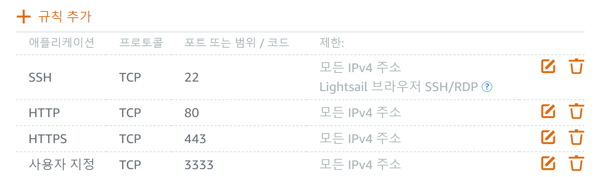

# Dobie 
> Infrastructure Service Platform for Beginners

[kr](README_kr.md)
<p align="right">[kr](README_kr.md)</p>

Dobie recognizes the problem that beginner developers need to spend a lot of time learning to deploy for the first time. To solve this, Dobie is designed to significantly reduce the time it takes to set up and deploy an initial environment, making it easy for anyone to use. Experience a simple and quick deployment environment with Dobie.

## About Dobie

- Dobie is an infrastructure service platform that is easy for beginners to use.
- Users can deploy their projects by entering simple information.
- Dobie manages users' projects as containers using Docker and Docker Compose.

### Supported Environments
- **Backend**

    Spring Boot(maven), Spring Boot(gradle), Django, FastAPI
- **Frontend**

    React, Vue
- **Database**

    MySQL, MongoDB, Redis

### HTTPS

- By enabling the HTTPS button, you can easily use the HTTPS environment.
- The process of obtaining SSL certificates from Let's Encrypt is automated to make HTTPS easy to use.

### Expandable Open Source

- Dobie is an open-source project and hopes to grow into a better project by communicating with external developers.
- Dobie can be installed on AWS EC2 instance Ubuntu servers.
- Dobie supports various development languages and frameworks and plans to add more in the future.

### 📚 Skills

- Backend 
 
- Frontend 
  
- Infra 
   

## User Guide

1. To install and run Dobie, execute the following script:

    ```bash
    # Download the shell script
    wget https://raw.githubusercontent.com/eunnseok/dobie-deploy/main/install-dobie.sh
    # Grant execute permission to the shell script
    chmod +x install-dobie.sh
    # Execute the shell script
    sh install-dobie.sh
    ```

2. Open port **3333** for Dobie to use.
    

3. Access Dobie at `domainName:3333` to get started.
4. Sign up on Dobie. Share one account with your team members working on the same project.
    
5. After logging in, follow the guide page to proceed with using Dobie.
    

## Git Convention

### Branch Strategy
- Based on the Git-flow strategy, we operate with main, develop branches, and feature support branches.
- Development is divided into main, develop, and feature branches.

**1. Basic Branch Strategy**

- `main` branch: This branch is used only for stable versions and deployment stages.
- `develop` branch: This branch serves as the master in the git-flow for the development stage. It is divided into `dev-be` and `dev-fe` for backend and frontend management, respectively. This branch is periodically merged into `main`.

**2. Feature Branches**

- Feature branch (`feature/`): Used for an independent development environment for each feature. For example, you can name branches as `feature/fe/login`, `feature/be/login`. When development is complete, merge into `dev-fe` or `dev-be`.
- Use camel case for naming feature branches.

### **Commit Message**

- Write commit types in uppercase English.

| Commit Type     | Meaning                                            |
|-----------------|----------------------------------------------------|
| FEAT            | Add new feature                                    |
| FIX             | Fix bugs                                           |
| DOCS            | Modify documentation                               |
| STYLE           | Code formatting, missing semicolons, no code change|
| TEST            | Add or refactor test code                          |
| CHORE           | Update package manager, other changes e.g., .gitignore|
| DESIGN          | Change CSS or user UI design                       |
| COMMENT         | Add or modify necessary comments                   |
| RENAME          | Only rename or move files/folders                  |
| REMOVE          | Only delete files                                  |
| !BREAKING CHANGE| Major API changes                                  |
| !HOTFIX         | Urgent bug fix                                     |
| REFACTOR        | Restructure code without changing functionality    |
| REFINE          | Improve readability and performance without major changes|

- After the commit type, write the description in Korean for clarity.

## Contributor Guide

- If you find bugs while using Dobie or want to contribute to the project, please refer to the guide.

### Before Contributing
- All work related to Dobie is communicated through Git.
- Dobie manages bugs through Git Issues. Before registering a new bug, please check if it is already being discussed.

### How to Report an Issue
Feel free to submit issues via Git Issues. Follow the issue_templates and include the following:

- Refer to [Issue Labels](https://lab.ssafy.com/s10-final/S10P31B101/-/labels) when submitting issues.

1. Issue summary
2. Steps to reproduce the issue
3. Dobie configuration or service where the issue occurred

## Code Style Guide
> This guide is to improve readability and facilitate smooth communication through consistent coding practices among developers.

### Code Convention
Java and JavaScript follow Google's Style Guide.
- [Google Java Style Guide](https://google.github.io/styleguide/javaguide.html)
- [Google JavaScript Style Guide](https://google.github.io/styleguide/jsguide.html)

### Data Style Guide
Dobie uses JSON format to avoid running unused database containers.

## Issue Templates

### Feature Request

- Part
  - [ ] FE
  - [ ] BE
  - [ ] Database
- Detailed Description of Feature
  - Explain which parts of the feature should be implemented.
- Deadline
  - Set a deadline.

## Merge Request Templates

### Why did you make this MR?
- [ ] Feature merge (leave feature issue #)
- [ ] Bug fix (leave issue # below)
- [ ] Code improvement
- [ ] Other (detailed description below)

### Screenshot and Detailed Description - Explain why this MR is necessary in detail.
- Explain the details in bullet points.

### Before MR
- [ ] Did you run a local code lint check?
- [ ] Did you run a local CI test?

### Relevant Issue Number
- Enter the relevant issue number if any.

## License

This project is licensed under the MIT LICENSE. See the [LICENSE](LICENSE) file for more details.

## Version: 1.0.0
